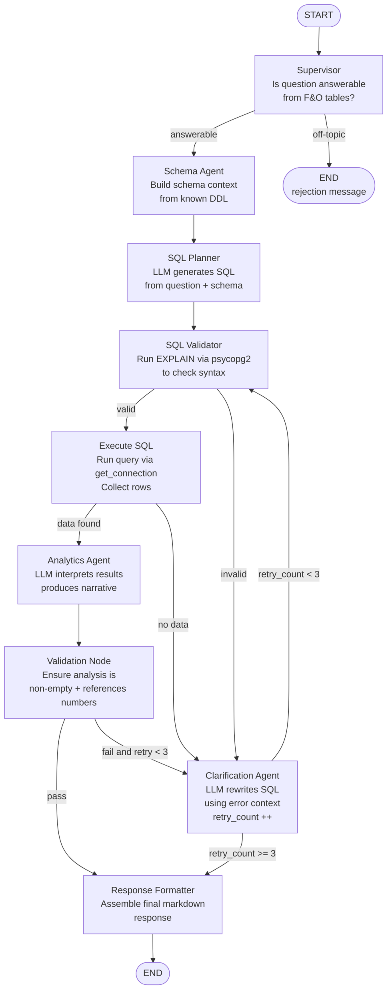

# Module 9 — Multi-Agent F&O Data Analysis (LangGraph)

🔴 **Complex**

## What was built

- `agents/__init__.py` — package marker
- `agents/graph.py` — LangGraph state machine (9 nodes, conditional edges, retry logic)
- `pages/analytics.py` — Streamlit analysis UI (chat-style input, SQL expander, dataframe results)
- `requirements.txt` — added langgraph, langchain-core, langchain-ollama
- `Dockerfile` — added `COPY agents/ agents/`

## Architecture

### Agent Flow



### Node Summary

| Node | LLM? | DB? | Key output |
|---|---|---|---|
| supervisor | ✅ | ❌ | route decision |
| schema_agent | ❌ | ✅ `list_tables()` | `schema_context` |
| sql_planner | ✅ | ❌ | `sql_query` |
| sql_validator | ❌ | ✅ `EXPLAIN` | `sql_valid`, `validation_error` |
| execute_sql | ❌ | ✅ SELECT | `query_results`, `data_found` |
| clarification | ✅ | ❌ | revised `sql_query` |
| analytics | ✅ | ❌ | `analysis` narrative |
| validation | ❌ | ❌ | pass / fail route |
| response_formatter | ❌ | ❌ | `final_response` |

### State Schema (`AnalysisState` TypedDict)

```
question, schema_context, sql_query, sql_valid, validation_error,
query_results, data_found, analysis, final_response, retry_count
```

### LLM

`ChatOllama` (`langchain-ollama`) — reads `OLLAMA_HOST` and `MODEL_NAME` env vars.
Same Ollama server already running; no new infrastructure.

### DB

All DB calls reuse `get_connection()` and `list_tables()` from `ingestion/db.py`.

### Tracing

`sql_planner`, `clarification_agent`, `analytics_agent` wrapped in OpenTelemetry spans
(`openinference.span.kind = "LLM"`) — same pattern as `app.py`.

## Validation

```powershell
pip install -r requirements.txt             # dependencies install cleanly
ruff check app.py pages/ ingestion/ agents/ # lint passes
pytest tests/ -v                            # no regressions
streamlit run app.py                        # F&O Analysis page appears in sidebar

# Happy path (DB + Ollama running):
# Ask: "What was total realized PnL by symbol on 2026-05-19?"
# Expected: SQL generated, executed, narrative answer with symbol breakdown

# Off-topic rejection:
# Ask: "What is the weather today?"
# Expected: supervisor rejects with clear message, no SQL attempted

helm.exe lint helm/chatbot                  # chart lint still clean
```

## Known Limitations

- SQL Planner may hallucinate column names on complex JOINs; Clarification Agent
  catches these via the EXPLAIN validator
- Analytics narrative quality depends on the Ollama model in use
- No streaming — `graph.invoke()` runs synchronously; spinner shown during execution
